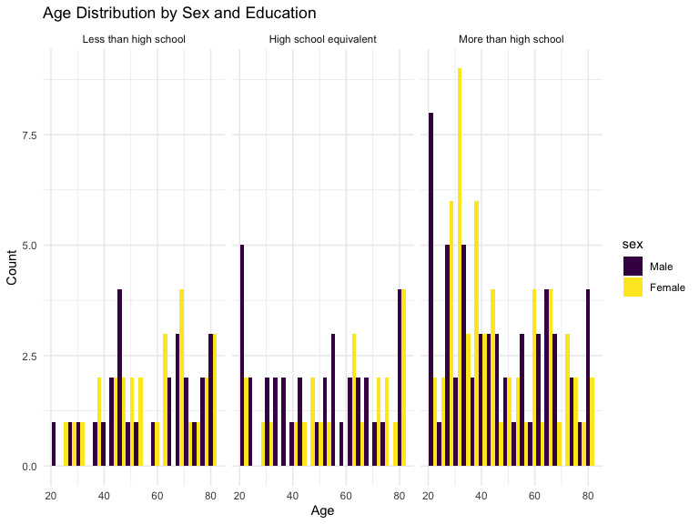
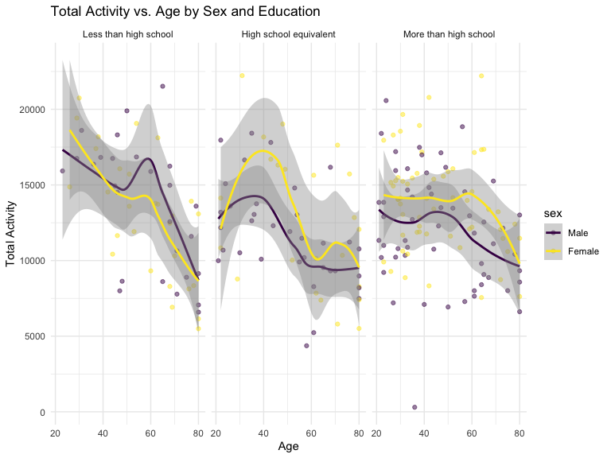
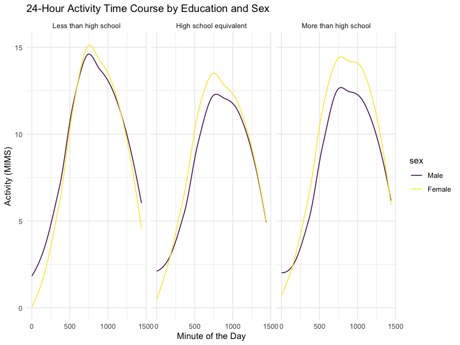
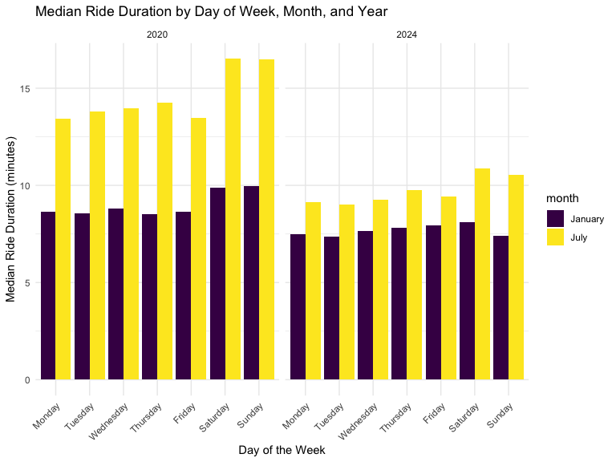
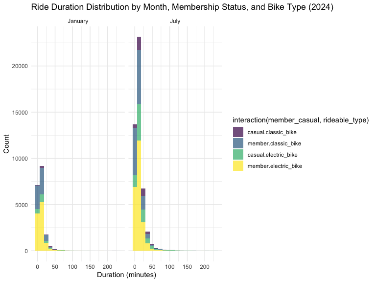

P8105_HW3_YX2953
================
Vivian XIA
2024-10-13

Problem 1

``` r
library(tidyverse)
```

    ## ── Attaching core tidyverse packages ──────────────────────── tidyverse 2.0.0 ──
    ## ✔ dplyr     1.1.4     ✔ readr     2.1.5
    ## ✔ forcats   1.0.0     ✔ stringr   1.5.1
    ## ✔ ggplot2   3.5.1     ✔ tibble    3.2.1
    ## ✔ lubridate 1.9.3     ✔ tidyr     1.3.1
    ## ✔ purrr     1.0.2     
    ## ── Conflicts ────────────────────────────────────────── tidyverse_conflicts() ──
    ## ✖ dplyr::filter() masks stats::filter()
    ## ✖ dplyr::lag()    masks stats::lag()
    ## ℹ Use the conflicted package (<http://conflicted.r-lib.org/>) to force all conflicts to become errors

``` r
library(ggridges)
library(patchwork)

library(p8105.datasets)

knitr::opts_chunk$set(
    echo = TRUE,
    warning = FALSE,
    fig.width = 8, 
  fig.height = 6,
  out.width = "90%"
)

theme_set(theme_minimal() + theme(legend.position = "bottom"))

options(
  ggplot2.continuous.colour = "viridis",
  ggplot2.continuous.fill = "viridis"
)

scale_colour_discrete = scale_colour_viridis_d
scale_fill_discrete = scale_fill_viridis_d
data("ny_noaa")
```

``` r
ny_noaa %>% 
  count(snow) %>%
  arrange(desc(n))
```

    ## # A tibble: 282 × 2
    ##     snow       n
    ##    <int>   <int>
    ##  1     0 2008508
    ##  2    NA  381221
    ##  3    25   31022
    ##  4    13   23095
    ##  5    51   18274
    ##  6    76   10173
    ##  7     8    9962
    ##  8     5    9748
    ##  9    38    9197
    ## 10     3    8790
    ## # ℹ 272 more rows

``` r
ny_noaa = 
  ny_noaa %>% 
  separate(date, into = c("year", "month", "day"), convert = TRUE) %>% 
  mutate(
    tmax = as.numeric(tmax),
    tmin = as.numeric(tmin))
```

Below is a two-panel plot showing the average max temperature in January
and in July in each station across years. As expected, the mean
temperature in January is much lower than the mean temperature in July
for all stations and across all years. All stations appear to follow
similar trends of temperature peaks and valleys within a month across
the years, i.e. when one station has a high monthly mean temperature for
a given year, most other stations also have a high monthly mean
temperature for that year. We do see one uncharacteristically cold
station in July of 1987 or 1988, as well as a few other less drastic
outliers.

``` r
ny_noaa %>% 
  group_by(id, year, month) %>% 
  filter(month %in% c(1, 7)) %>% 
  summarize(mean_tmax = mean(tmax, na.rm = TRUE, color = id)) %>% 
  ggplot(aes(x = year, y = mean_tmax, group = id)) + geom_point() + geom_path() +
  facet_grid(~month) +
  labs(title = "Mean monthly temperature for each station across years for January and July")
```

    ## `summarise()` has grouped output by 'id', 'year'. You can override using the
    ## `.groups` argument.


Below we show a two-panel plot including (i) a hex plot of `tmax` vs
`tmin` for the full dataset; and (ii) a ridge plot showing the
distribution of snowfall values (in mm) greater than 0 and less than 100
separately by year.

From the hex plot we see that while there is some variability, the
majority of the data cluster tightly in the center of the distribution.
In relatively rare cases, it seems that `tmax` is less than `tmin`,
which raises questions about data recording and quality.

From the ridge plot, we see a multimodel density of snowfall within a
given year. Most stations see between 0 and 35 mm of snow in a year.
Then there is a another group of stations that see about 45 mm of snow,
and another group that sees nearly 80 mm. It is likely this
multimodelity stems from the conversion of measurements in one system
(fractions of an inch) to another (using the metric system), which was
also noted in the table of common values.

``` r
hex = 
  ny_noaa %>% 
  ggplot(aes(x = tmin, y = tmax)) + 
  geom_hex()

ridge = 
  ny_noaa %>% 
  filter(snow < 100, snow > 0) %>%
  ggplot(aes(x = snow, y = as.factor(year))) + 
  geom_density_ridges()

hex + ridge
```

    ## Picking joint bandwidth of 3.76


Problem 2

``` r
library(tidyverse)

# Load the datasets
covar_path <- "Data File/nhanes_covar.csv"
accel_path <- "Data File/nhanes_accel.csv"

# Clean and prepare demographic data, filter out the participants less than 21 and delete the missing ones
covar_df <- read_csv(covar_path, skip = 4)
```

    ## Rows: 250 Columns: 5
    ## ── Column specification ────────────────────────────────────────────────────────
    ## Delimiter: ","
    ## dbl (5): SEQN, sex, age, BMI, education
    ## 
    ## ℹ Use `spec()` to retrieve the full column specification for this data.
    ## ℹ Specify the column types or set `show_col_types = FALSE` to quiet this message.

``` r
colnames(covar_df) <- c("SEQN","SEX", "AGE", "BMI", "EDUCATION")
covar_df <- covar_df %>%
  mutate(
   seqn = as.integer(SEQN),
    sex = factor(SEX, levels = c(1, 2), labels = c("Male", "Female")),
    age = as.numeric(AGE),
    BMI = as.numeric(BMI),
    education = factor(EDUCATION, levels = c(1, 2, 3), 
                       labels = c("Less than high school", 
                                  "High school equivalent", 
                                  "More than high school"))
  )%>%
filter(age >= 21)%>%
drop_na()

# Load and prepare accelerometer data
accel_df <- read_csv(accel_path)
```

    ## Rows: 250 Columns: 1441
    ## ── Column specification ────────────────────────────────────────────────────────
    ## Delimiter: ","
    ## dbl (1441): SEQN, min1, min2, min3, min4, min5, min6, min7, min8, min9, min1...
    ## 
    ## ℹ Use `spec()` to retrieve the full column specification for this data.
    ## ℹ Specify the column types or set `show_col_types = FALSE` to quiet this message.

``` r
# Merge accelerometer data with demographic data
merged_df <- inner_join(accel_df, covar_df, by = "SEQN")

# Create a summary table of men and women by education level
summary_table <- merged_df %>%
  group_by(education, sex) %>%
  summarise(count = n()) %>%
  pivot_wider(names_from = sex, values_from = count, values_fill = 0)
```

    ## `summarise()` has grouped output by 'education'. You can override using the
    ## `.groups` argument.

``` r
# Display the summary table
print(summary_table)
```

    ## # A tibble: 3 × 3
    ## # Groups:   education [3]
    ##   education               Male Female
    ##   <fct>                  <int>  <int>
    ## 1 Less than high school     27     28
    ## 2 High school equivalent    35     23
    ## 3 More than high school     56     59

``` r
# Plot age distribution by sex and education
ggplot(merged_df, aes(x = age, fill = sex)) +
  geom_histogram(position = "dodge", bins = 20) +
  facet_wrap(~ education) +
  labs(title = "Age Distribution by Sex and Education",
       x = "Age", y = "Count") +
  theme_minimal()
```



``` r
# Create total activity for each participant by summing across minutes
merged_df <- merged_df %>%
  mutate(total_activity = rowSums(select(., starts_with("min"))))

# Plot total activity against age, faceted by education and colored by sex
ggplot(merged_df, aes(x = age, y = total_activity, color = sex)) +
  geom_point(alpha = 0.5) +
  geom_smooth(method = "loess") +
  facet_wrap(~ education) +
  labs(title = "Total Activity vs. Age by Sex and Education",
       x = "Age", y = "Total Activity") +
  theme_minimal()
```

    ## `geom_smooth()` using formula = 'y ~ x'



``` r
# Create a time-course plot of activity over a 24-hour period, colored by sex
merged_df_long <- merged_df %>%
  pivot_longer(
    cols = starts_with("min"),
    names_to = "minute",
    values_to = "activity",
    names_prefix = "min"
  ) %>%
  mutate(minute = as.numeric(minute))

ggplot(merged_df_long, aes(x = minute, y = activity, color = sex)) +
  geom_line(stat = "smooth", method = "loess", se = FALSE) +
  facet_wrap(~ education) +
  labs(title = "24-Hour Activity Time Course by Education and Sex",
       x = "Minute of the Day", y = "Activity (MIMS)") +
  theme_minimal()
```

    ## `geom_smooth()` using formula = 'y ~ x'



Comments on summary table of men and women by education level:

• The number of men and women is fairly balanced in the “Less than high
school” and “More than high school” categories. • However, for “High
school equivalent” education, there are significantly more men compared
to women. This could indicate differences in educational attainment
patterns between men and women within this sample.

Comments on age distribution by sex and education:

Less than high school: • Both men and women show a nearly even
distribution across a broad age range, with more accumulations in the
older age groups (around 60–80 years). • The distributions of two sex
are similar. High school equivalent: • The distribution of women is more
decentralized, while men show more clusters in specific age groups
(around 20–40 years and 60–80 years). More than high school: • The
largest age group for men appears to be around 40–60 years, with
representation across the 20–80 age range. • Women in this category are
more evenly spread across all age groups, with a slight concentration
around the 40–60 age.

More older individuals are less than high school educated, possibly
reflecting past generations where fewer people completed high school.
Conversely, younger people are more concentrated in the higher education
categories, reflecting more recent educational improvement trends.

Comment on the plot of total activity vs age by sex and education: 1.
Less than High School: • For both men and women, total activity
decreases with age, with a peak around the younger ages (20–30) and then
a steep decline as age increases. • There is some difference between men
and women, especially in older age groups, where men’s activity levels
appear slightly higher than women’s. • The confidence intervals (gray
shaded regions) widen as age increases, indicating greater variability
in total activity among older individuals in this education category. 2.
High School Equivalent: • There is a more obvious age-related activity
pattern in this group, where activity peaks around the age of 50 for
both men and women, followed by a sharp decline after this age. • For
younger individuals under 40, women’s activity levels appear higher than
men’s, but the roles reverse for individuals above 50. • There is a
large variance in total activity, especially between ages 40 to 70,
indicating some individuals in this group remain highly active while
others see a significant drop-off. 3. More than High School: • Activity
levels are relatively stable between men and women across different
ages, with only a slight downward trend for both above 60. Both are with
much smaller confidence intervals. • This category shows that
individuals with higher education tend to maintain more consistent
activity levels across their lifespan compared to those with lower
education levels.

Comment on 24-hour activity time course by educationa dnd sex: 1.
General Daily Trend: • Across all education levels, both men and women
show a sharp rise in activity starting early in the day, peaking around
the middle of the day, and then gradually declining in the evening. 2.
Sex Differences: • In the “Less than high school” and “High school
equivalent” categories, women tend to have slightly higher activity
levels than men throughout the day, particularly around midday. • In the
“More than high school” category, women also show higher midday activity
levels, but the difference is smaller compared to the other two groups.
3. Education Patterns: • The shape of the activity curves is consistent
across education levels, but individuals with higher education maintain
higher activity levels throughout the day, particularly during midday,
compared to those with lower education levels.

Problem 3

``` r
# Load required libraries
library(tidyverse)

files <- list(
  july_2024 = read_csv("Data File/July 2024 Citi.csv", show_col_types = FALSE),
  jan_2020 = read_csv("Data File/Jan 2020 Citi.csv", show_col_types = FALSE),
  jan_2024 = read_csv("Data File/Jan 2024 Citi.csv", show_col_types = FALSE),
  july_2020 = read_csv("Data File/July 2020 Citi.csv", show_col_types = FALSE)
)

# Add a 'source' column to track the original file
data_list <- lapply(names(files), function(name) {
  df <- files[[name]]
  df$source <- name
  return(df)
})

# Combine all datasets into one
combined_data <- bind_rows(data_list) 
glimpse(combined_data)
```

    ## Rows: 99,485
    ## Columns: 8
    ## $ ride_id            <chr> "86AE148E36FBF035", "FCF07A30F66B9B07", "D8397E843C…
    ## $ rideable_type      <chr> "classic_bike", "electric_bike", "classic_bike", "e…
    ## $ weekdays           <chr> "Sunday", "Thursday", "Thursday", "Tuesday", "Wedne…
    ## $ duration           <dbl> 19.661183, 7.676433, 24.465950, 3.528600, 24.126050…
    ## $ start_station_name <chr> "Picnic Point", "W 54 St & 9 Ave", "12 Ave & W 40 S…
    ## $ end_station_name   <chr> "Yankee Ferry Terminal", "W 42 St & 8 Ave", "W 84 S…
    ## $ member_casual      <chr> "casual", "casual", "member", "member", "casual", "…
    ## $ source             <chr> "july_2024", "july_2024", "july_2024", "july_2024",…

``` r
combined_data %>%
  count(source)
```

    ## # A tibble: 4 × 2
    ##   source        n
    ##   <chr>     <int>
    ## 1 jan_2020  12420
    ## 2 jan_2024  18861
    ## 3 july_2020 21048
    ## 4 july_2024 47156

``` r
combined_data
```

    ## # A tibble: 99,485 × 8
    ##    ride_id   rideable_type weekdays duration start_station_name end_station_name
    ##    <chr>     <chr>         <chr>       <dbl> <chr>              <chr>           
    ##  1 86AE148E… classic_bike  Sunday      19.7  Picnic Point       Yankee Ferry Te…
    ##  2 FCF07A30… electric_bike Thursday     7.68 W 54 St & 9 Ave    W 42 St & 8 Ave 
    ##  3 D8397E84… classic_bike  Thursday    24.5  12 Ave & W 40 St   W 84 St & Amste…
    ##  4 E575690C… electric_bike Tuesday      3.53 Grand St & Haveme… S 4 St & Rodney…
    ##  5 184AABED… electric_bike Wednesd…    24.1  Broadway & Kent A… Henry St & Degr…
    ##  6 ACA61A92… classic_bike  Saturday     7.83 E 1 St & 1 Ave     Mercer St & Spr…
    ##  7 C48F946C… classic_bike  Sunday       4.85 Lenox Ave & W 117… Frederick Dougl…
    ##  8 F3072F6E… classic_bike  Saturday     4.33 W 53 St & 10 Ave   West End Ave & …
    ##  9 8A283594… electric_bike Thursday    12.6  W 10 St & Washing… Stanton St & Ch…
    ## 10 EFFCEE4C… electric_bike Friday      10.6  W 55 St & 6 Ave    Broadway & W 41…
    ## # ℹ 99,475 more rows
    ## # ℹ 2 more variables: member_casual <chr>, source <chr>

``` r
# create summary table, total rides by year, month, user type

combined_data <- combined_data %>%
  mutate(
    month = if_else(str_detect(source, "jan"), "January", "July"),
    year = str_extract(source, "\\d{4}"),  
    year = as.integer(year) 
  )

# summarize the total number of data
summary_table <- combined_data %>%
  group_by(year, month, member_casual) %>%
  summarise(total_rides = n(), .groups = "drop")


# display the summary table
summary_table
```

    ## # A tibble: 8 × 4
    ##    year month   member_casual total_rides
    ##   <int> <chr>   <chr>               <int>
    ## 1  2020 January casual                984
    ## 2  2020 January member              11436
    ## 3  2020 July    casual               5637
    ## 4  2020 July    member              15411
    ## 5  2024 January casual               2108
    ## 6  2024 January member              16753
    ## 7  2024 July    casual              10894
    ## 8  2024 July    member              36262

Comments: 1. Members vs. Casual Users: Members consistently take more
rides than casual users, with a significant difference in both years. 2.
Seasonal Variation: Rides are more in July compared to January for both
groups, showing more activity in the summer. 3. Growth Over Time: Total
rides increased from 2020 to 2024, with both members and casual users
riding more, indicating growing popularity of the service.

``` r
# find the top 5 popular starting station in July 2024

top_stations_july_2024 <- combined_data %>%
  filter(source == "july_2024") %>%
  count(start_station_name, sort = TRUE) %>%
  top_n(5, n)

# display the top 5 stations
top_stations_july_2024
```

    ## # A tibble: 5 × 2
    ##   start_station_name           n
    ##   <chr>                    <int>
    ## 1 Pier 61 at Chelsea Piers   163
    ## 2 University Pl & E 14 St    155
    ## 3 W 21 St & 6 Ave            152
    ## 4 West St & Chambers St      150
    ## 5 W 31 St & 7 Ave            146

``` r
# coreect the orfer
combined_data$weekdays <- factor(combined_data$weekdays, 
                                 levels = c("Monday", "Tuesday", "Wednesday", "Thursday", "Friday", "Saturday", "Sunday"))

# Plot median ride duration by day of the week, month, and year

ggplot(combined_data, aes(x = weekdays, y = duration, fill = month)) +
  stat_summary(fun = median, geom = "bar", position = "dodge") +
  facet_wrap(~ year) +
  labs(title = "Median Ride Duration by Day of Week, Month, and Year",
       x = "Day of the Week", y = "Median Ride Duration (minutes)") +
  theme_minimal()+
theme(axis.text.x = element_text(angle = 45, hjust = 1))
```



Key Observations and comments:

1.  Seasonal Variation: • Rides in July (blue bars) consistently have
    longer median durations than those in January (red bars) for both
    years, suggesting that people take longer rides in the summer.
2.  Day of the Week Patterns: • In both 2020 and 2024, weekends
    (Saturday and Sunday) tend to have longer ride durations, with
    Sunday in July showing the longest durations. • Weekdays generally
    show more consistent ride lengths, but still longer in July compared
    to January.
3.  Yearly Comparison: • Ride durations in July 2024 are generally
    shorter than in July 2020, indicating a possible trend toward
    shorter rides over time. • January ride durations remain relatively
    stable between 2020 and 2024.

``` r
# Filter for 2024 data
duration_distribution_plot <- combined_data %>%
  filter(year == 2024) %>%
  ggplot(aes(x = duration, fill = interaction(member_casual, rideable_type))) +
  geom_histogram(bins = 20, position = "stack", alpha= 0.7 )+
  facet_wrap(~month) +
  labs(title = "Ride Duration Distribution by Month, Membership Status, and Bike Type (2024)", x = "Duration (minutes)", y = "Count") +
  theme_minimal()

print(duration_distribution_plot)
```



Key Observations and comments:

1.  Skewed Distribution: • The ride durations are heavily skewed to the
    right, with the vast majority of rides lasting less than 50 minutes.
    Very few rides last longer than 100 minutes, indicating that short
    rides are far more common.
2.  Membership and Bike Type: • Members (especially using electric
    bikes, represented in purple) tend to dominate the count of rides,
    particularly in July, suggesting that electric bikes are a popular
    option among members. • Casual riders (both classic and electric
    bikes) have lower ride counts compared to members. This trend is
    consistent across both months.
3.  Month Comparison: • Rides in July are significantly higher than in
    January for all, showing that people are more likely to use bikes
    during the summer months. • Electric bikes are particularly popular
    among members in July, with the highest count observed for this
    group.
4.  Classic vs. Electric Bikes: • Across both months, electric bikes
    (both casual and member riders) have higher counts compared to
    classic bikes, indicating a preference for electric bikes,
    especially for shorter rides.
